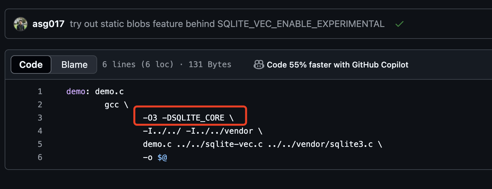
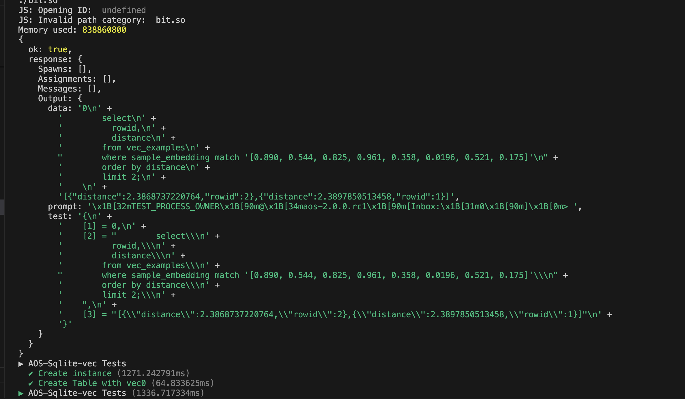
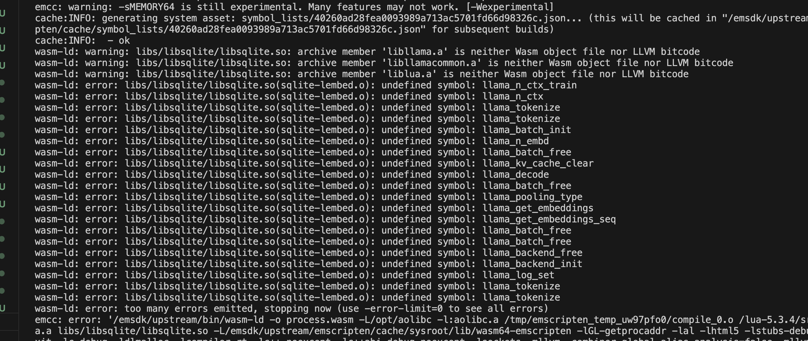

### sqlite-vec 与 lsqlite的连接
https://github.com/asg017/sqlite-vec/blob/main/examples/simple-c/Makefile

参考这个项目

-DSQLITE_CORE 这个宏打开了那么里面找不到sqlite3_api的定义，

https://github.com/permaweb/aos-sqlite/blob/main/container/src/lsqlite3.c

lsqlite3里面也找不到 sqlite3_column_type 的定义，这个存在于sqlite3ext.h 中

应该全部用 SQLITE_CORE 去编译，因为在sqlite3.h中也有这个api的定义

sqlite-lembed.o 没有连接到 llama

### Makefile 导读

#### Vendor目录
1. aos   https://github.com/permaweb/aos/archive/3b81b69cc07461126c4e461aca53591b40bd3751.zip
2. llamacpp 暂时没写，也是从github获得
3. sqlite 从官网下载 有和sqlite-vec项目中的版本对比过，没有太大差别，先用新版的观察

#### src目录
1. lib 编译aos_process_lib中的库 的源码
2. process 要拷贝到 aos_process目录下的源文件

#### 编译需求
1. 底层是llama，为sqlite-lembed提供支持，这里编译为静态库，直接放入process目录 libllama.a 和 libllamacommon.a， 直接采用ao-llama中的编译方法，emcmake cmake 然后 emmake make
2. 然后是sqlite3, 独立编译sqlite3.c, makefile中在docker中单独用emcc为其编译
3. 然后是sqlite-vec 和 sqlite-lembed, 
4. lsqlite是lua入口，需要连接lua库
5. 生成的libllama.a, libllamacommon.a, lsqlite3.o, sqlite-lembed.o, sqlite-vec.o, sqlite3.o, .o文件emar 连接成为libsqlite.so
6. libllama.a, libllamacommon.a, libsqlite.so放入process/libs下面
7. 使用镜像调用AO_BUILD_MODULE构建wasm