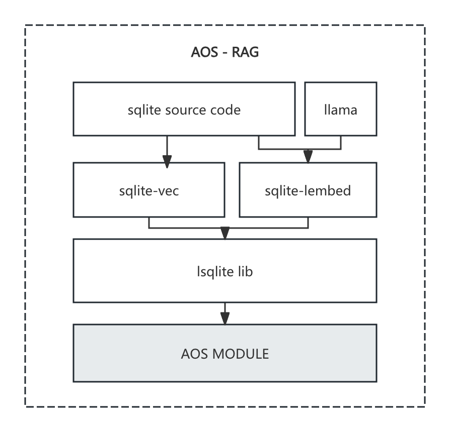
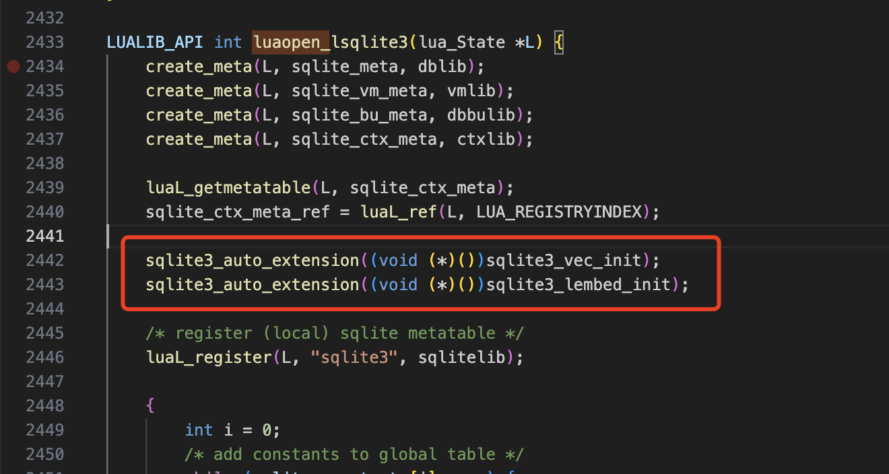
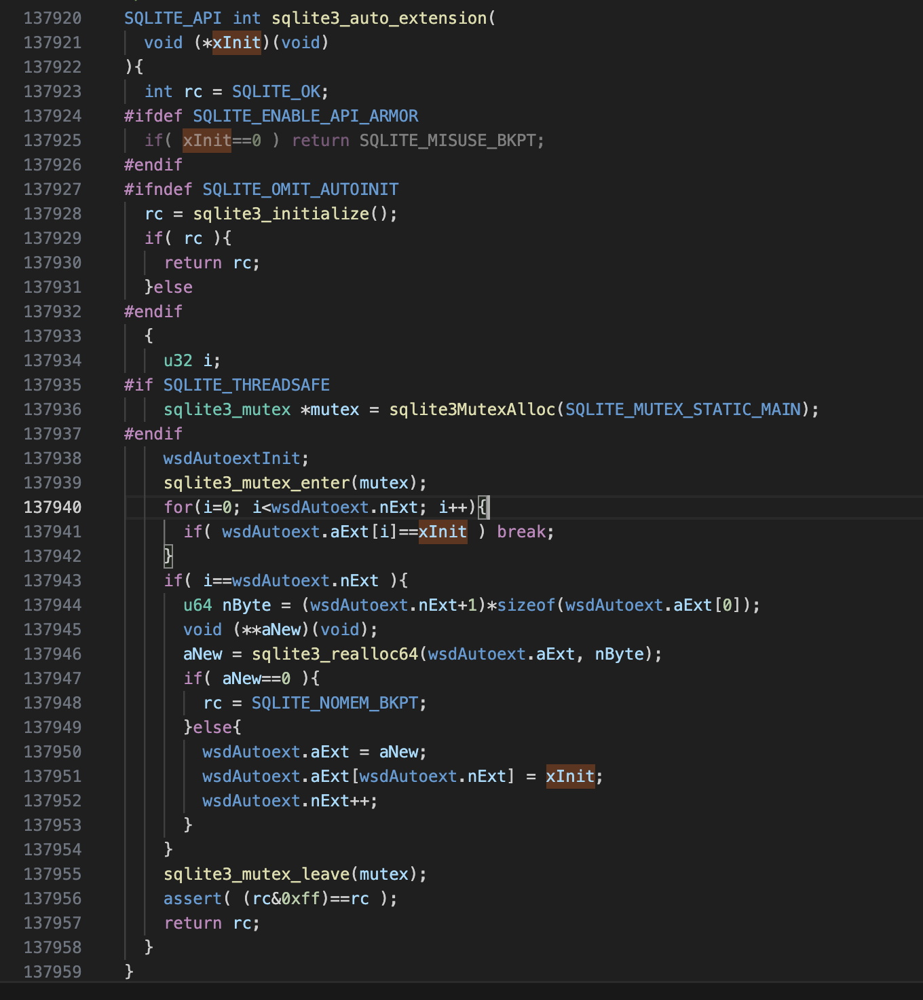
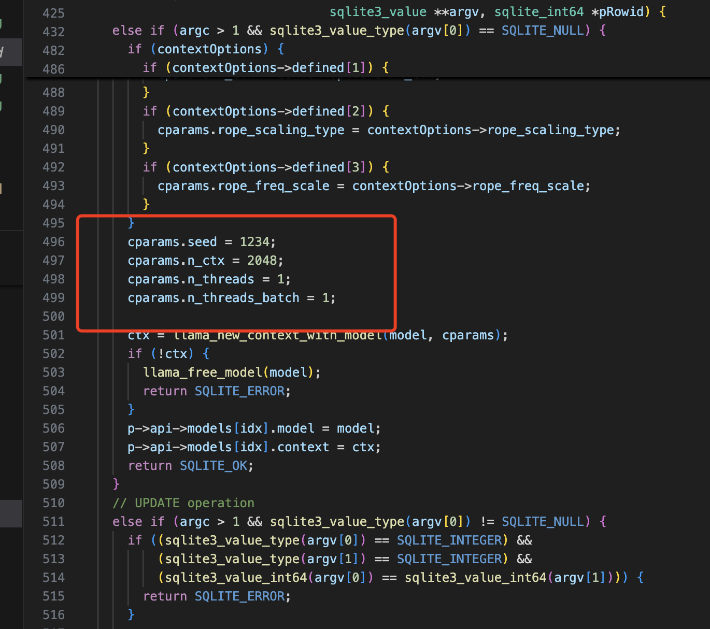
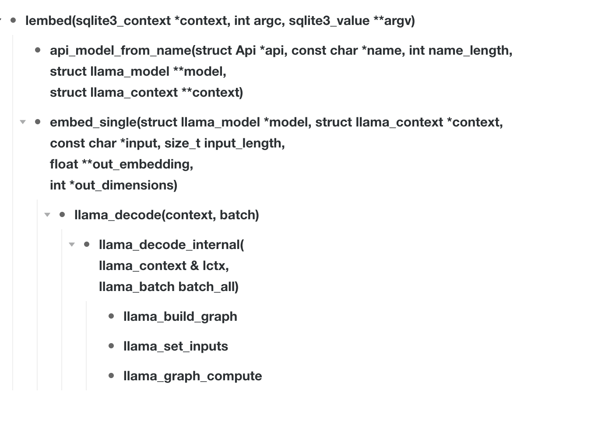

# aos-rag

## Intro

This project is designed to provide on-chain **RAG**(**R**etrieval-**A**ugmented **G**eneration) ability for [aos](https://cookbook_ao.g8way.io/guides/aos/index.html) process.

The target of the build is an ao module, everyone can start an aos process with this module loaded to achieve the ability to do on-chain **RAG**.

\* The functionality is coupled with the sqlite3 library, all capabilities are integrated into SQLite3 extensions.

## Reference

- **AO-llama** (https://github.com/PeterFarber/AO-Llama)  
  This project demonstrates how to integrate the llama runtime environment into an AOS process as a callable library. It provides methods for compiling libraries within the process and outlines the basic compilation and linking logic for the llama library.

- **sqlite-lembed** (https://github.com/asg017/sqlite-lembed)
  This project provides the load extension function to support auto loading sqlite-lembed ability. After loaded, the library will provide functions in sqlite statements. We can use them in SQL statements.

- **sqlite-vec** (https://github.com/asg017/sqlite-vec)
  This project provides the load extension function to support auto loading sqlite-vec ability. After loaded, we can use the functions to process vetors and calculate the distance between vectors in SQL statements.


## Quickstart

```Shell
// prepare vendor and make
// Makefile use docker image to build, so if there are difficulties with pulling image
// You can run docker pull to get the image by yourself

make vendor
make
```

After running `make`, outputs `process.js` and `process.wasm` will be found in the directory `test/`.

```Shell
// The size of output process.wasm may be 4.7M, it will cost 0.003 AR, there should be enough balanc in your AR wallet.

export WALLET='YOUR WALLET JSON FILE LOCATION'
node scripts/deploy_module.js
```

You can load the module you just updated, or directly use our module.

```Shell
aos {process_name} --module={module_id}
```

Run the command to start the process with aos-rag module.

```Shell
.load process/main.lua
```

Run `.load` command to load the test lua file.

### Test

```SQL
  INSERT INTO temp.lembed_models(name, model) select 'all-MiniLM-L6-v2', lembed_model_from_file('/data/0FzCdvtr3yldxGsaTBkfdaSchhGwd-2k487ZoIogofI');
```

Firstly, load the model by the above statement.


```SQL

  create table articles(
    headline text
  );
  
  -- Random NPR headlines from 2024-06-04
  insert into articles VALUES
    ('Shohei Ohtani''s ex-interpreter pleads guilty to charges related to gambling and theft'),
    ('The jury has been selected in Hunter Biden''s gun trial'),
    ('Larry Allen, a Super Bowl champion and famed Dallas Cowboy, has died at age 52'),
    ('After saying Charlotte, a lone stingray, was pregnant, aquarium now says she''s sick'),
    ('An Epoch Times executive is facing money laundering charge');
```

And then create the table named articles, insert records.


```SQL
  -- Build a vector table with embeddings of article headlines
  create virtual table vec_articles using vec0(
    headline_embeddings float[1600]
  );
  
  insert into vec_articles(rowid, headline_embeddings)
    select rowid, lembed('all-MiniLM-L6-v2', headline)
    from articles;
```

Create the table `vec_articles` with vec0 extension and call the function lembed for each record in `articles` to insert the vectors.

### Compilation Structure



##### Step 1:  
- sqlite3.o : sqlite3.c
- libllama.a, common/libcommon.a : llamacpp cmake & make

##### Step 2:
- sqlite-vec.o: sqlite-vec.c -I{SQLITE_DIR} -DSQLITE_CORE
- sqlite-lembed.o: sqlite-lembed.c -I{SQLITE_DIR} -I{LLAMA_DIR} -DSQLITE_CORE

##### Step 3:
- lsqlite3.o: lsqlite3.c -I{SQLITE_VEC_DIR} -I{SQLITE_LEMBED_DIR} -I{LUA_LIB}

##### Step 4:
- libsqlite.so: sqlite3.o sqlite-vec.o sqlite-lembed.o lsqlite3.o

##### Step 5:
- Move libllama.a common/libcommon.a (from step 1) and libsqlite.so (from step 4) to aos/process/libs

##### Step 6:
- Ao build module to generate wasm

### Source Code Introduction

We have to figure out what is the entrance for the library. So we have to learn from the test file.

(source: https://github.com/PeterFarber/AO-Llama/blob/main/test-llm/afs.test.js#L23)

```typescript
const res = await instance.cwrap('handle', 'string', ['string', 'string'], { async: true })(JSON.stringify(msg), JSON.stringify(env))
```

The function call can be traced in the following location:

(source: https://github.com/permaweb/aos/blob/main/process/process.lua#L247)

So the function is to monitor the environment in aos process.

Besides, we should make it clear how our source codes are bundled in the aos process. How can we access the functions in lua blurprint.

We know that all the libraries `.so`, `.a` are lined by the command `ao-build-module` in the image `p3rmaw3b/ao:0.1.4`. So the image might be from the repo [https://github.com/permaweb/ao](https://github.com/permaweb/ao). After searcing `ao-build-module` in the repo, we can find that, the docker build command below.

```shell
COPY ./src/ao-build-module /usr/local/bin/ao-build-module
```

(source: https://github.com/permaweb/ao/blob/a83cc872b48bd79e4b7f8f4d9c4451c745550fcb/dev-cli/container/Dockerfile#L87)

The main logic of command `ao-build-module` just exists in the file [https://github.com/permaweb/ao/blob/a83cc872b48bd79e4b7f8f4d9c4451c745550fcb/dev-cli/container/src/ao-build-module](https://github.com/permaweb/ao/blob/a83cc872b48bd79e4b7f8f4d9c4451c745550fcb/dev-cli/container/src/ao-build-module).


As per the logic in ao-llama project, those libraries are stored in the directory `aos/process/libs`. So we can keep this in mind and check the source code.

Extend libraries:
(source: https://github.com/permaweb/ao/blob/a83cc872b48bd79e4b7f8f4d9c4451c745550fcb/dev-cli/container/src/ao-build-module#L142-L146)

Load libraries logic:
(source: https://github.com/permaweb/ao/blob/a83cc872b48bd79e4b7f8f4d9c4451c745550fcb/dev-cli/container/src/ao-build-module#L84)
(source: https://github.com/permaweb/ao/blob/a83cc872b48bd79e4b7f8f4d9c4451c745550fcb/dev-cli/container/src/ao_module_lib/libraries.py#L27)

Scan bundle libraries in `src/libs`:
(source:https://github.com/permaweb/ao/blob/a83cc872b48bd79e4b7f8f4d9c4451c745550fcb/dev-cli/container/src/ao_module_lib/libraries.py#L45-L48)

Load libraries by pattern `[^dD] _?luaopen_([0-9a-zA-Z!"#\$%&\'\(\)\*\+,\-\.\/:;\<=\>\?@\[\]^_`\{\|\}~]+)`
(source:https://github.com/permaweb/ao/blob/a83cc872b48bd79e4b7f8f4d9c4451c745550fcb/dev-cli/container/src/ao_module_lib/libraries.py#L80-L85)

So the entrance of these libraries is the function named like `luaopen_XXXX()`.

Therefore if we want to support `sqlite-vec` and `sqlite-lembed` in sqlite extension by the simple sentence `local sqlite = require('lsqlite3')`, there should be a function called `luaopen_lsqlite3` in these source codes. And in this function, the `vec` and `lembed` extensions should be loaded, so we have to learn from the project `sqlite-vec` and `sqlite-lembed` how to get there.

(sqlite-vec: https://github.com/asg017/sqlite-vec/blob/main/examples/simple-c/demo.c#L12)
(sqlite-lembed: )

It seems that there is no example in `sqlite-lembed` projet, but the two files `sqlite-vec.c` and `sqlite-lembed.c` have similar structure and functions.
(sqlite-lembed: https://github.com/asg017/sqlite-lembed/blob/main/sqlite-lembed.c#L855C9-L855C28)

We just need use the two mentioned functions to load sqlite3 extensions, all functions we need to support RAG will be auto detected and added.



The base `lsqlite3.c` is from the github repo aos-sqlite.
(source: https://github.com/permaweb/aos-sqlite/blob/main/container/src/lsqlite3.c)

After making the decision, I have to consider whether it's legal to do this. Questions like why this function does not need sqlite instance or how this sentence can impact all the sqlite3 instance appears.

The function `sqlite3_auto_extension` is found in sqlite3.c : L137920,



We can clearly see that the function is not called and just registered somewhere, attached to something global. And function `sqlite3_vec_init` and `sqlite3_lembed_init` both have the parameter `sqlite3 *db`. So modifications in the luaopen_lsqlite3 function are highly likely to take effect, as we’re simply adding two initialization methods to the original queue. Then, when a new sqlite3 instance is created, these functions will be called back to load the methods for it.

After that, the current compilation logic is too difficult to debug and test. Projects have different scripts or makefiles to get the output. We should get a simple makefile to get everything done.

The entry point lsqlite is definitely at the top level since it is the closest to the Lua layer. Then comes `sqlite-vec`, it has no dependency, just provide functions to calculate vector distance. The `sqlite-lembed` component is responsible for text tokenization and embedding, which depends on the library `llama`. All these functions are based on the basic sqlite library.

So now we have three vendors:
- aos, receive libraries input and compile these into wasm module.
- llama.cpp, provide functinos for `sqlite-lembed`.
- sqlite, the basis of all projects.

When compiling these object files, 
- `lsqlite` access the Lua interface, so it needs to load the header files and the Lua library itself, as we will not be compiling the Lua runtime separately.
- `sqliet-vec` and `sqlite-lembed` need to turn on `SQLTE_CORE` marco.
  \* Firstly, I thought that it cannot run in `SQLITE_CORE` mode, since the function `sqlite3_column_type` is a marco function `sqlite3_api->column_type` and sqlite3_api should be declared. If `SQLITE_CORE` is defined, `sqlite3_ext.h` will pass these declarations. Actually the same function is defined in `sqlite.h`, so turn on the `SQLITE_CORE`, it will work as well.
  ```c
  // sqlite3_ext.h L433
  #define sqlite3_column_type            sqlite3_api->column_type
  ``` 
  ```c
  // sqlite.h L5281
  SQLITE_API int sqlite3_column_type(sqlite3_stmt*, int iCol);
  ```
- keep the make logic of the llama.cpp since it's complicated and hard to modify. The outputs of the project are two `.a` library, simply dropping these files in process/libs would work.

Until then, all works have been done, we can run make and test to check the source code itself.

The project `sqlite-lemebd` didn't run smoothly, so we spent plenty of time debugging it.  

First question we met is that the local env runs in multi-thred mode, but in wasm, it supports only one thread. It was an assertion failure rc == 0 with line number, so we get to file `vendor/llama.cpp/ggml.c`:L19523, check the context around and found the setting is from the llama context, we can pass it in function `lembed_modelsUpdate` to limit `n_threads` to 1, and this error will disappear.



And then we met the question that distance result is not shown, other performance seems really normal. So we found a way to log in the source code, use `EM_ASM` function from `emscription.h` to run javascript code in the source file.  

The call chain is shown below:



Function `lembed` is the entrance for sql statement `lembed(model_name, text)`, in this function,  `api_model_from_name` will set the model by searching with the model name, and call `embed_single` to get out_embeddings. In the function `llama_decode`, the graph will be built and computed to get the result float number array.

We stuck here because the output embedding array is all `NaN` when `normalize`. It is because the embd of `lctx` is all zero, the square root of the sum of squares of a zero array, used as the divisor, results in an embedding array of NaN. 

So we start to research on this, where can modify the `ctx->embd`, after ruling out many possibilities, we started to suspect there might be an issue with the model's computation layer, specifically whether certain macros were not enabled. Or it could be a compatibility issue with WASM support causing certain methods to fail.

Since the model's internal computations are primarily extensive vector operations and are not closely tied to the underlying layers, they shouldn't be affected by such portability and compatibility issues. Therefore, we believe the problem lies in model loading.

In the end, instead of digging deeper, we stepped back and confirmed that the issue was indeed with the model file loading. The problem was finally resolved, and the module was successfully compiled and deployed.

However, the problem-solving approach and debugging methods used here are still worth documenting, as they can serve as a foundation for future projects.